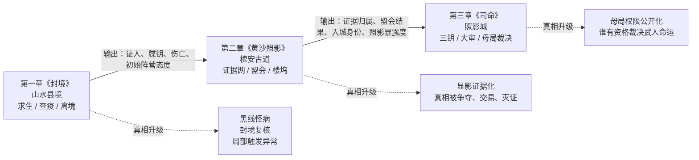
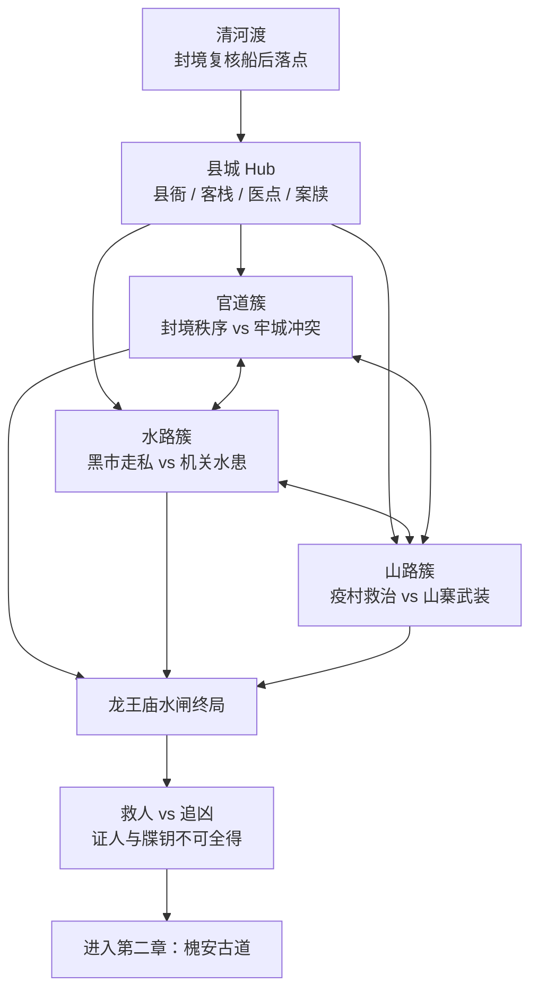
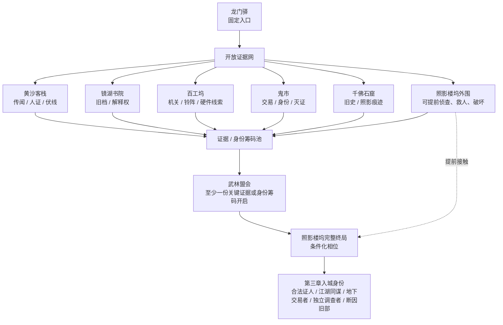
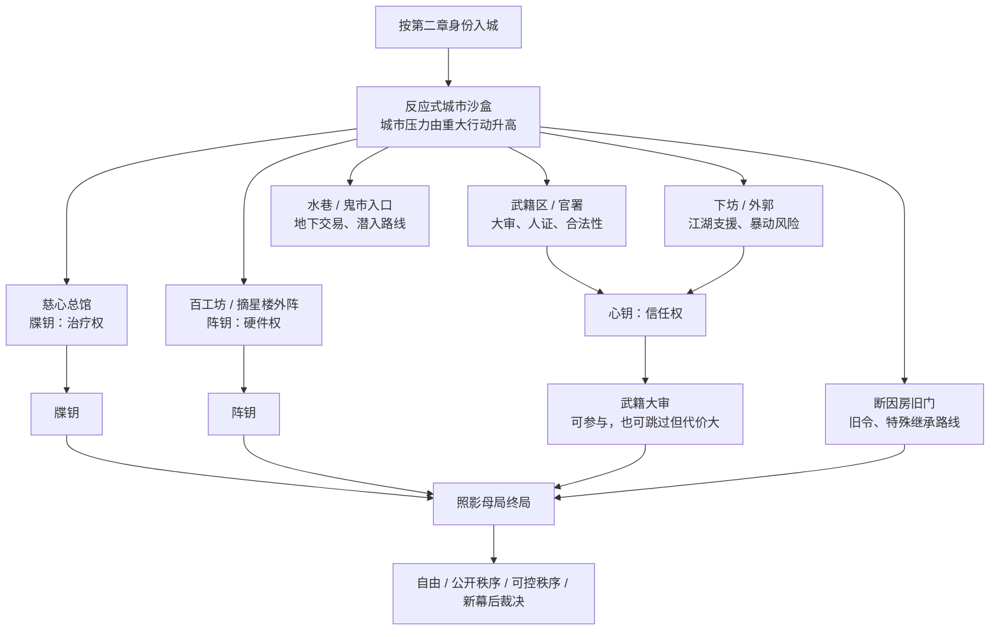

# 04 Mainline Quest Skeleton

状态：ground truth
日期：2026-04-26
用途：定义《山水照影录》主线任务骨架的设计层级、统一战役目标、三章章级结构和后续区域 / 任务设计约束。旧剧情蓝本、章节细稿、网站内容和 `docs/reference/` 中的历史方案与本文冲突时，以本文为准。

## 1. Scope

本文只锁定主线任务骨架的高层结构。

本文处理：

- 主线从高到低应按哪些层级展开；
- 所有起源角色为什么共享一条主线；
- 照影牒针如何持续驱动战役；
- 三章各自如何重新解释并升级统一目标；
- BG3 式自由度在章节骨架中的边界；
- 后续区域层、任务层和变量层必须遵守的设计规则。

本文不处理：

- 第一章区域地图细化；
- 单个任务剧本、对白、场景卡；
- 具体数值、检定 DC、战斗 encounter；
- 网站页面、图片生成或美术资产；
- build 系统规则，相关 ground truth 见 `01-build-system-milestone.md`；
- 黑线、牒针和显影机制的客观世界规则，相关 ground truth 见 `02-world-setting.md`；
- 政治阵营结构和机构认知边界，相关 ground truth 见 `03-political-faction-restructure.md`。

## 2. 主线设计层级

主线任务设计必须按以下层级从高到低展开。下层不得反向改写上层。

| 层级 | 名称 | 设计问题 | 产物 |
|---:|---|---|---|
| -1 | 核心命题层 | 故事最终在问什么？ | 全游戏最高问题。 |
| 0 | 战役目标层 | 为什么所有起源角色必须同行？ | 统一目标和共同危机。 |
| 1 | 持续压力层 | 目标为什么不会变成开场借口？ | 可持续触发的系统性压力。 |
| 2 | 章节层 | 每一章如何重新解释并升级战役目标？ | 三章章级定义。 |
| 3 | 区域层 | 每章用什么空间承载自由探索、压力和结算？ | 区域结构、hub、路线、相位场景。 |
| 4 | 主线任务层 | 每个任务推进哪一段章级功能？ | 主线任务链和任务职责。 |
| 5 | 单任务结构层 | 单个任务如何触发、冲突、解法和结算？ | 任务 packet、分支矩阵、失败推进。 |
| 6 | 变量回收层 | 哪些选择必须被后续章节和结局承认？ | 变量表、回收表、结局条件。 |

设计顺序必须先锁当前层级，再进入下一层。区域设计不能先于章节层；任务设计不能先于区域层；对白和场景卡不能先于单任务结构层。

## 3. 核心命题层

全游戏最高问题是：

> 谁有资格记录、预测、控制和裁决天下武人的命运？

所有阵营、牒针、母局、审判、队友终局和世界结局都必须服务这个问题。主线任务不能只提供战斗、潜入或谈判入口；每个主线任务都必须改变玩家对这个问题的理解、立场或筹码。

## 4. 战役目标层

统一战役目标是：

> 一群被照影牒针卷入的人，为了活下去和解除禁制，被迫从山水县走向照影城；他们最初寻找的是解法，最后发现自己必须决定照影母局的命运。

这一目标对应 BG3 式共同危机结构。自定义主角、起源角色和核心队友都可以因为照影牒针共享主线动力，但每个人对牒针的反应、旧债、恐惧和诱惑不同。

玩家表层目标随章节升级：

| 阶段 | 玩家以为的目标 | 真实升级 |
|---|---|---|
| 第一章 | 压住牒针、查明封城疫病、活着离开山水县。 | 发现县境灾变是照影局的筛选实验。 |
| 第二章 | 追查牒针来源，寻找解除方法。 | 发现真相会被各方争夺、扭曲、交易或灭证。 |
| 第三章 | 进入照影城，彻底解除牒针控制。 | 发现解除自己只是最小目标，必须裁决母局制度。 |

## 5. 持续压力层

照影牒针不是单纯死亡倒计时，而是可触发控制系统。

| 压力来源 | 叙事作用 | 玩法作用 |
|---|---|---|
| 照影铃 | 远程诱发错拍、幻听、昏厥、狂乱或共感。 | 让音律、奇门、潜入和反制任务成立。 |
| 药性 | 牒针可被压制、污染、强化或误诊。 | 让药师、医毒、慈心医脉和黑市蛊医都能介入。 |
| 机关权限 | 牒钥、阵钥和硬件节点可以读取、延迟或改写触发。 | 让百工坞、机括、潜入和母局改造路线成立。 |
| 档案权限 | 牒录记录武人过往、风险预判和可控等级。 | 让审案、证据归属、武籍大审和政治路线成立。 |
| 断因诱导 | 无名煞可被旧令、杀意和未来祸端档案诱发。 | 让特殊起源拥有诱惑、抵抗、利用和长期代价。 |

压力规则：

- 牒针必须持续制造任务压力，但不使用硬性死亡倒计时。
- 玩家可以通过调查、治疗、偷窃、机关、音律、审案或战斗降低局部压力。
- 越接近真相，牒针越应从“病”变成“权限系统”。
- 真正解除牒针必须追到照影城和照影母局。

牒针、稳心验脉、引脉和显影归档的客观机制以 `02-world-setting.md` 为准。缉武司、同尘盟和照影局分别知道多少，以 `03-political-faction-restructure.md` 为准。

### 5.1 牒针真相揭示节奏

主线只负责安排玩家何时理解这些真相，不在本文件重述完整机制和机构内情。

| 章节 | 玩家可见信息 | 叙事功能 |
|---|---|---|
| 第一章《封境》 | 黑线怪病、封境复核、失控伤亡、局部触发异常。 | 让玩家先以为问题是疫病、疯症、封城和求生。 |
| 第二章《黄沙照影》 | 显影结果被交易、灭证、篡改，并开始变成武籍证据。 | 让玩家意识到真相解释权正在被各方争夺。 |
| 第三章《司命》 | 母局权限、三钥、大审和城市压力把显影制度推到公开裁决层面。 | 让玩家最终裁决这套系统是否有资格继续存在。 |

## 6. 章节层

### 6.1 第一章《封境》--山水县境

章级定义：

> 第一章不是“逃出新手村”，而是一个封闭县境里的牺牲实验：玩家起初只想压住牒针、查明封城疫病、活着离开，最后在龙王庙水闸发现这一切是照影局的筛选实验，并必须在救人和追凶之间取舍。

已锁要点：

| 项 | 锁定内容 |
|---|---|
| 空间结构 | 封闭沙盒。 |
| 表层目标 | 封城疫病求生。 |
| 隐藏真相 | 牒针筛选实验。 |
| 揭示时机 | 龙王庙水闸终局。 |
| 终局轴 | 救人 vs 追凶。 |
| 后续变量 | 证人与牒钥。 |

设计规则：

- 第一章前半段可以让玩家感受到牒针异常，但不能过早把整个县境解释为照影局筛选实验。
- 县衙封境、疫村失控、水路水闸、山神寨冲突都必须能被水闸终局重新解释为筛选实验的一部分。
- 水闸终局不能只是 Boss 战；它必须让玩家在县城百姓 / 牒针宿主与白微尘 / 牒钥 / 真相线索之间做不可全得的选择。
- 第一章后果必须能进入第二章：救下的人变成证人，追到的凶和牒钥变成照影线索。

### 6.2 第二章《黄沙照影》--槐安古道

章级定义：

> 第二章不是线性追查，而是开放证据网：玩家带着第一章留下的证人与牒钥进入槐安古道，在多个地点自由取得、损毁、交易或扭曲证据，最终通过武林盟会和照影楼坞决定自己以什么身份进入照影城。

已锁要点：

| 项 | 锁定内容 |
|---|---|
| 结构 | 固定入口，开放中段，相位化高潮，条件化终局。 |
| 入口 | 龙门驿。 |
| 中段地点 | 黄沙客栈、镜湖书院、百工坞、鬼市、千佛石窟、照影楼坞外围可乱序接触。 |
| 武林盟会 | 至少一份关键证据或身份筹码开启，是中后段高潮。 |
| 照影楼坞 | 可提前侦查、偷袭、救人、破坏；完整终局相位需要条件触发。 |
| 终局轴 | 决定第三章入城身份。 |
| 入城身份 | 合法证人、江湖同谋、地下交易者、独立调查者、断因旧部。 |

设计规则：

- 第二章必须保留 BG3 式自由度：中段地点不是线性清单，玩家可以乱序接触。
- “盟会倒计时”不是硬性时间限制；玩家可以主动触发盟会，但必须至少拥有一份关键证据或身份筹码。
- 关键地点允许提前进入，但按相位变化。提前去照影楼坞时，应提供外围侦查、偷档案、救宿主、破坏设备、惊动照影局等版本，而不是空气墙。
- 完整楼坞终局必须依赖足够的政治局势、证据状态或盟会后相位。
- 第二章终局的重点不是玩家“知道了什么”，而是玩家带着什么政治身份进入照影城。

第三章入城身份定义：

| 入城身份 | 来源 | 第三章初始含义 |
|---|---|---|
| 合法证人 | 证据交给缉武司、公开作证或获得官方文书。 | 武籍区较易进入，但全程被监控。 |
| 江湖同谋 | 支持同尘盟、保护江湖证人或让盟会转向江湖解释。 | 下坊和外郭支援增强，戒严更早升级。 |
| 地下交易者 | 与鬼市交易证据、身份或牒钥。 | 水巷入口增强，但证据可能被拍卖或勒索。 |
| 独立调查者 | 保留关键证据，不完全交给任何阵营。 | 自主性最高，但初始盟友和合法性不足。 |
| 断因旧部 | 无名煞继承或利用断因暗号。 | 断因房旧部开门，但会索要继承承诺。 |

### 6.3 第三章《司命》--照影城

章级定义：

> 第三章是反应式城市沙盒：玩家带着前两章所有债进入照影城，通过取得三钥、处理队友终局、改变城市压力和参与或绕过武籍大审，最终决定照影母局代表的是自由、公开秩序、可控秩序，还是新的幕后裁决。

已锁要点：

| 项 | 锁定内容 |
|---|---|
| 结构 | 反应式城市沙盒。 |
| 阶段目标 | 取得三钥。 |
| 三钥含义 | 牒钥是治疗权，阵钥是硬件权，心钥是信任权。 |
| 城市压力 | 由重大行动触发升压，不使用真实倒计时。 |
| 武籍大审 | 中后段总清算，可跳过但代价大。 |
| 终局轴 | 自由 vs 可控秩序。 |
| 跳过大审后果 | 心钥不足、城市更混乱、结局选项减少，更偏硬闯、摧毁或接管。 |

设计规则：

- 照影城不能只是结局菜单。它必须识别玩家前两章身份、证据、盟友、债务和罪行。
- 城市压力不能靠真实时间惩罚玩家；应由重大行动触发，例如公开举证、杀关键 NPC、偷钥、发动暴动、破坏机关、强攻城防或使用断因旧令。
- 三钥不是三件普通道具，而是三种裁决资格。
- 武籍大审用于集中回收前两章证据，但不能硬性剥夺潜入、鬼市、强攻或无名煞路线。
- 跳过大审必须可行，但代价明确：心钥不足、城市混乱、队友或阵营信任不足，终局更偏硬闯 / 摧毁 / 接管，较难走公开改造或公开律法路线。

三钥定义：

| 钥匙 | 含义 | 主要来源 | 影响 |
|---|---|---|---|
| 牒钥 | 治疗权 | 慈心总馆、鬼市、照影刺客、宿主救治线。 | 决定能否把治疗功能和控制功能分开。 |
| 阵钥 | 硬件权 | 百工坊、机关图、摘星楼外阵、唐小砚线。 | 决定能否改造母局硬件，而不是只能摧毁。 |
| 心钥 | 信任权 | 人证、队友信任、阵营支持、武籍大审。 | 决定是否有人相信玩家有资格裁决母局。 |

### 6.4 暂存结构图预览

本节暂存当前三章关系与地图拓扑预览。它用于指导后续区域层讨论，不等同于最终关卡平面图。

三章关系：

第一章地图：山水县境

第二章地图：槐安古道

第三章地图：照影城

## 7. 自由度与相位规则

GameW 的 BG3 式自由度不是“所有终局无条件提前完成”，而是：

> 地点可以提前接触，关键结算按相位和条件变化。

规则：

- 不用空气墙阻止玩家进入合理可达地点。
- 提前进入关键地点时，提供侦查、交易、偷袭、救人、破坏、惊动敌人或取得局部筹码等相位。
- 大型政治结算节点需要最低条件，例如关键证据、身份筹码、阵营引荐或无名煞旧令。
- 提前破坏、偷证、杀人、救人都必须改变后续结算，而不是被主线重置。
- 玩家可以缺证推进，但缺证会改变局势、加大代价或关闭部分结局，而不是直接失败。

## 8. 后续设计约束

区域层展开时，每章区域表必须记录：

- 区域功能；
- 玩家首次接触方式；
- 可提前进入的相位；
- 承载的章级压力；
- 能改变的变量；
- 与章节终局的关系。

主线任务层展开时，每个主线任务必须记录：

- 它推进“解除照影牒针”的哪一步；
- 它回答核心命题的哪一部分；
- 它属于章节层的哪个功能位；
- 它支持哪些非线性接触或失败推进；
- 它写入哪些后续变量。

单任务结构层展开时，每个任务至少记录：

- 触发；
- 表层目标；
- 隐藏信息或转折；
- 至少三类解法；
- 失败推进；
- 队友 / 起源角色介入；
- 变量写入；
- 后续回收。

变量回收层展开时，每章必须至少保留以下回收：

| 章节 | 必须回收 |
|---|---|
| 第一章 | 证人状态、牒钥状态、县境伤亡、阵营初始态度、无名煞觉醒。 |
| 第二章 | 证据归属、盟会结果、楼坞相位、入城身份、照影局暴露程度。 |
| 第三章 | 三钥状态、城市压力、大审结果、母局权限、队友终局、世界结局。 |

## 9. Consistency Checks

当前章级骨架必须满足以下一致性检查：

- BG3 式自由度保留：地点可提前接触，关键结算按相位和条件变化，而不是用空气墙硬锁。
- 统一目标成立：所有起源角色都能因为牒针危机共享主线。
- 三章递进成立：求生解除牒针 -> 争夺真相解释权 -> 裁决母局制度。
- 第一章后果能进入第二章：证人与牒钥变成证据网和盟会筹码。
- 第二章后果能进入第三章：入城身份改变城市初始相位。
- 第三章能回收全局：三钥、大审、城市压力和母局结局承认前两章选择。

## 10. Next Design Step

下一步进入 **第一章区域层样板**，但不得跳过区域层直接写任务剧本。

第一章区域层样板应先回答：

- 山水县封闭沙盒如何组织 hub、外圈路线和终局水闸；
- 县城、疫村、山神寨、水路、旧镖道、废书院分别承载什么章级压力；
- 哪些地点可提前进入，哪些地点有相位变化；
- 每个区域如何服务“封城疫病求生”表层目标和“牒针筛选实验”终局揭示；
- 哪些区域变量会进入第二章证据网和第三章证词。
