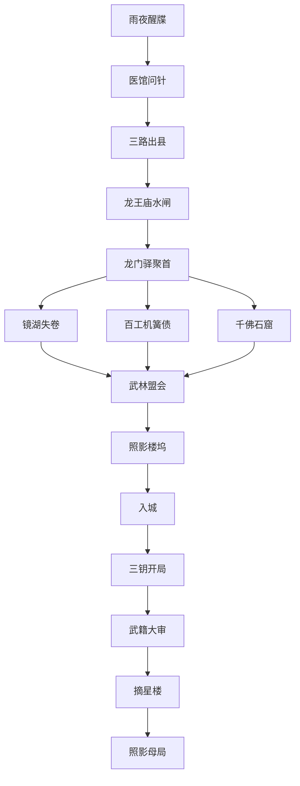

# 任务大纲、剧情推进与分支选择

本文记录《山水照影录》三章主线、支线、队友任务、分支选择和变量回收。任务设计目标是实现高自由度武侠 CRPG：每个主线任务至少提供战斗、潜入、社交、流派、队友或无名煞中的多种解法。

---

# 0. 任务设计规则

## 0.1 每个主线任务最低配置

| 项 | 要求 |
|---|---|
| 入口 | 至少 2 种触发方式。 |
| 解法 | 至少 4 类解法。 |
| 阵营影响 | 至少影响 1 个阵营声望。 |
| 队友影响 | 至少触发 1 名队友态度变化或专属对话。 |
| 变量记录 | 至少写入 2 个后续可回收变量。 |
| 失败态 | 失败不是 game over，而是进入更差或更暴力的后续分支。 |

## 0.2 解法标签

| 标签 | 说明 |
|---|---|
| `COMBAT` | 正面战斗、Boss 战、战术地形。 |
| `STEALTH` | 潜入、绕路、偷钥匙、替换证据。 |
| `SOCIAL` | 谈判、威胁、辩论、阵营声望。 |
| `INVESTIGATION` | 查案、找证据、盘问、翻供。 |
| `MEDICINE` | 药师、医毒、稳态、牒针压制。 |
| `MECHANISM` | 奇门、机关、阵法、符禁。 |
| `MUSIC` | 音律、稳心、错拍、破铃。 |
| `COMPANION` | 队友专属解决方式。 |
| `DARK_ORIGIN` | 无名煞顺煞、压煞、引煞、换煞。 |

---

# 1. 全局主线流

---

# 2. 第一章：《封境》

## A1-M01 雨夜醒牒

| 项 | 内容 |
|---|---|
| 类型 | 开场主线 |
| 地点 | 清河渡 |
| 目标 | 活下来，确认车队遇袭原因，发现腕脉黑线。 |
| 关键 NPC | 押车兵、幸存孩童、濒死牒使、黑衣袭击者。 |
| 核心冲突 | 玩家醒来时不知道自己是囚犯、护送者、受害者还是凶手。 |

### 剧情节点

1. 玩家在翻覆车队中醒来；
2. 腕脉浮现黑线；
3. 押车兵恐惧玩家；
4. 远处黑衣人带走一只照影铃；
5. 玩家发现半毁牒录和第一枚破裂牒钥线索。

### 主要选择

| 选择 | 标签 | 后果 |
|---|---|---|
| 救幸存者 | MEDICINE / SOCIAL | 获得山水县证人；`A1_SURVIVORS_SAVED = true`。 |
| 搜尸取牒录 | INVESTIGATION | 获得早期线索；县衙怀疑玩家；`A1_TIE_RECORD_FRAGMENT = obtained`。 |
| 追击黑衣人 | COMBAT / STEALTH | 提前接触照影局；部分幸存者死亡。 |
| 向县衙自首 | SOCIAL | 获得合法保护但失去部分自由；缉武司关注上升。 |
| 杀人灭口 | DARK_ORIGIN / COMBAT | 隐藏开场证据；队友后续信任降低；`DARK_BODYCOUNT += 1`。 |
| 假装昏迷 | STEALTH | 可偷听押车兵和黑衣人对话。 |

### 后续回收

- 第三章外郭中，幸存者可为玩家作证或控诉玩家；
- 无名煞若灭口，断因房在第二章更早识别玩家；
- 牒录残片可在镜湖书院中拼合。

---

## A1-M02 医馆问针

| 项 | 内容 |
|---|---|
| 类型 | 主线调查 |
| 地点 | 山水县城、疫村、黑市、废书院 |
| 目标 | 弄清腕脉黑线是什么。 |
| 关键 NPC | 桑芷、黑市蛊医、何其庸、老药婆。 |
| 核心冲突 | 牒针无法硬拔，且懂它的人都不愿说真话。 |

### 可用路径

| 路径 | 解法 | 后果 |
|---|---|---|
| 慈心医馆 | 帮桑芷救疫村病人 | 招募桑芷；桑芷信任上升。 |
| 黑市蛊医 | 付钱或威胁蛊医 | 获得粗暴压制药，但有副作用。 |
| 县衙验伤 | 交出自己接受验伤 | 获得官方保护，也被登记。 |
| 废书院查书 | 奇门/音律解谜 | 获得“照影牒针”名词。 |
| 山神寨老药婆 | 完成山寨委托 | 获得民间偏方和山路情报。 |

### 核心揭示

牒针不是普通毒，硬拔会导致失忆、瘫痪、狂乱或死亡。它需要牒钥、药引和照影铃频共同处理。

---

## A1-M03 三路出县

| 项 | 内容 |
|---|---|
| 类型 | 沙盒主线 |
| 地点 | 官道、水路、山路 |
| 目标 | 找到离开山水县的方式。 |
| 核心冲突 | 每条路都被不同势力控制，且各有代价。 |

### 路线结构

| 路线 | 控制方 | 障碍 | 可解方式 | 结果变量 |
|---|---|---|---|---|
| 官道 | 县衙 / 缉武司 | 封境文书、武籍查验 | 文书、贿赂、辩论、强攻 | `A1_EXIT_ROUTE = official` |
| 水路 | 清河帮 / 水闸势力 | 水闸失控、帮派勒索 | 潜入、机关、交易、夺船 | `A1_EXIT_ROUTE = river` |
| 山路 | 山神寨 / 疫村隔离区 | 山寨路税、疫病封锁 | 结盟、医治、护送、战斗 | `A1_EXIT_ROUTE = mountain` |

玩家可只完成一条路线，也可完成全部路线以积累盟友、资源和证据。完成越多，第一章终局选择越丰富。

---

## A1-M04 龙王庙水闸

| 项 | 内容 |
|---|---|
| 类型 | 第一章终局 |
| 地点 | 龙王庙、水闸机关廊、阵眼闸室 |
| 目标 | 阻止照影铃阵，处理即将崩坏的水闸。 |
| 关键 NPC | 白微尘、何其庸、楚横山、桑芷、唐小砚。 |
| 核心冲突 | 救县城、救疫村、追真凶、保真相不能全部轻松兼得。 |

### 终局状态

照影局牒使白微尘准备启动水闸下的照影铃阵，让牒针宿主在混乱中互相残杀，并筛选可控者。

### 主要分支

| 路线 | 条件 | 后果 |
|---|---|---|
| 侠义救城 | 稳住水闸、停铃、放走白微尘 | `A1_SHANSHUI_STATE = saved`；线索减少。 |
| 追凶优先 | 追杀白微尘、夺牒钥 | `A1_FIRST_TIE_KEY = obtained`；`A1_SHANSHUI_STATE = flooded_partial`。 |
| 官府合作 | 帮何其庸掩盖试验 | 获得官方通行；桑芷强烈反感；`FACTION_JIWUSI_REP += 1`。 |
| 山寨夺闸 | 帮楚横山控制水路 | 山神寨成为盟友；县衙敌对。 |
| 机关改闸 | 唐小砚改造水闸分洪 | 代价最低；需完成唐小砚前置；`A1_TANG_WATERGATE_FIX = true`。 |
| 医者救针 | 桑芷压制宿主 | 宿主存活率上升；水闸损坏；`COMP_SANG_TRUST += 2`。 |
| 无名煞灭证 | 杀关键证人制造天灾假象 | 真相断裂；断因房关注；多个队友恐惧或离队。 |

### 后续回收

| 变量 | 第三章回收 |
|---|---|
| `A1_SHANSHUI_STATE = saved` | 山水县幸存者在武籍大审作证。 |
| `A1_SHANSHUI_STATE = flooded_partial` | 外郭难民控诉玩家。 |
| `A1_FIRST_TIE_KEY = obtained` | 三钥开局降低牒钥获取难度。 |
| `A1_TANG_WATERGATE_FIX = true` | 唐小砚第三章可改造母局。 |
| `A1_MAGISTRATE_ALLIED = true` | 第三章可获得官方入城文书，但被监控。 |

---

# 3. 第二章：《黄沙照影》

## A2-M01 龙门驿聚首

| 项 | 内容 |
|---|---|
| 类型 | 阵营主线 |
| 地点 | 龙门驿 |
| 目标 | 确认各方都在寻找玩家和牒钥。 |
| 关键 NPC | 缉武司西线校尉、同尘盟信使、阎三更、霍青鸢、照影牒使。 |
| 核心冲突 | 玩家变成多方争夺的异常宿主。 |

### 主要选择

| 选择 | 后果 |
|---|---|
| 正式入册 | 获得缉武司保护；同尘盟警惕。 |
| 假意投靠缉武司 | 可获取文书和情报；若被揭穿，第三章入城难度上升。 |
| 联络同尘盟 | 获得江湖援助；缉武司通缉值上升。 |
| 与鬼市交易 | 获得密道、伪造身份或黑医帮助；欠鬼市债。 |
| 帮霍青鸢查边地牒针 | 开启边地路线。 |
| 独立调查 | 阵营收益少，但保留第三章中立路线。 |

---

## A2-M02 镜湖失卷

| 项 | 内容 |
|---|---|
| 类型 | 调查主线 |
| 地点 | 镜湖书院 |
| 目标 | 找回“二十八宿牒录”。 |
| 核心冲突 | 失卷记录了牒针早期宿主和禁术源流，所有阵营都想得到。 |

### 解法

| 解法 | 标签 | 后果 |
|---|---|---|
| 正常查案 | INVESTIGATION | 找出偷卷人，获得书院支持。 |
| 夜入藏书楼 | STEALTH | 可不惊动书院，但被发现会永久降低书院声望。 |
| 公开辩论 | SOCIAL | 证明缉武司无权封卷，获得心钥线索。 |
| 帮鬼市偷卷 | STEALTH / SOCIAL | 获得鬼市好感，但可能失去书院支持。 |
| 音律破错拍机关 | MUSIC / COMPANION | 柳听弦好感上升。 |
| 奇门重排灯阵 | MECHANISM | 唐小砚或奇门主角特殊解。 |
| 无名煞认出旧案 | DARK_ORIGIN | 得知自己曾刺杀上一任藏书人。 |

### 核心揭示

牒针最初用于治疗战后疯症，后被照影局改造成预测、审判和控制武人的工具。

---

## A2-M03 百工机簧债

| 项 | 内容 |
|---|---|
| 类型 | 主线 / 队友任务 |
| 地点 | 百工坞 |
| 目标 | 查明百工坞是否制造过照影铃阵部件。 |
| 关键 NPC | 唐小砚、唐叙白、百工坞旧派长老。 |
| 核心冲突 | 技术是否需要为用途负责？ |

### 选择

| 选择 | 后果 |
|---|---|
| 曝光百工坞 | 百工坞声望下降；第三章百工坊内乱。 |
| 逼他们修复牒针 | 获得牒针技术帮助；唐小砚质疑玩家。 |
| 帮唐小砚夺权 | 第三章可改造母局；百工旧派敌对。 |
| 让缉武司接管 | 合法资源上升；技术进入官方监控。 |
| 与百工坞交易 | 获得城市机关图；保留其罪证。 |
| 摧毁工坊 | 照影局短期受创；第三章机关路线缺失。 |

---

## A2-M04 千佛石窟

| 项 | 内容 |
|---|---|
| 类型 | 石窟主线 |
| 地点 | 千佛石窟 |
| 目标 | 调查石窟中的照影旧史。 |
| 关键 NPC | 失明画僧、霍青鸢、照影局旧部、石窟守窟人。 |
| 核心冲突 | 旧史是真相，也是危险武器。 |

### 场景层级

| 区域 | 玩法 | 关键发现 |
|---|---|---|
| 外窟 | 社交、交易、收集传闻 | 石窟收留逃亡武人。 |
| 壁画廊 | 调查、辨伪 | 前朝武林大案与照影旧院有关。 |
| 回音窟 | 音律、潜入 | 错误声音可诱导敌我误判。 |
| 药香窟 | 药师、牒针压制 | 古香会触发牒针幻觉。 |
| 砂机关窟 | 奇门、机括、地形战 | 石门与流沙保护无面佛龛。 |
| 无面佛龛 | 叙事揭示、无名煞强触发 | 断因房体系早于大雍。 |

### 主要选择

| 选择 | 后果 |
|---|---|
| 公开石窟真相 | 第三章武籍大审获得强证据。 |
| 把壁画拓片交给缉武司 | 合法入城增强，但官方掌握古法。 |
| 把名册交给同尘盟 | 反抗力量增强，但激进派可能复仇滥杀。 |
| 交给霍青鸢 | 边地自治路线增强。 |
| 摧毁无面佛龛 | 照影局旧法受损，但无名煞线索减少。 |
| 无名煞接受断因判词 | 解锁少司命路线。 |

---

## A2-M05 武林盟会

| 项 | 内容 |
|---|---|
| 类型 | 第二章政治高潮 |
| 地点 | 黄沙古道会盟场 |
| 目标 | 决定山水县、牒针、石窟真相是否公开。 |
| 核心冲突 | 照影局借铃阵制造混乱，证明江湖不能自治。 |

### 参与方

- 缉武司西线；
- 同尘盟；
- 边军守将；
- 商路镖盟；
- 鬼市；
- 慈心医脉；
- 百工坞；
- 石窟僧人；
- 霍青鸢代表的边地部族。

### 玩家选择

| 选择 | 结果 |
|---|---|
| 暴露铃阵，救下盟会 | `A2_MARTIAL_ASSEMBLY = saved`；多阵营信任上升。 |
| 支持缉武司镇压 | `A2_MARTIAL_ASSEMBLY = suppressed`；合法入城路线增强。 |
| 帮同尘盟夺权 | `A2_MARTIAL_ASSEMBLY = radicalized`；第三章城市戒严。 |
| 刺杀关键领袖 | 阵营格局剧变；无名煞或影踪路线可用。 |
| 公开石窟证据 | 心钥增强；照影局敌意上升。 |
| 让霍青鸢发声 | 边地路线增强。 |
| 无名煞顺煞 | 盟会可能避免大战，但玩家成为恐惧对象。 |

---

## A2-M06 照影楼坞

| 项 | 内容 |
|---|---|
| 类型 | 第二章终局 |
| 地点 | 照影楼坞 |
| 目标 | 潜入、攻打或接管照影局外部据点。 |
| 核心冲突 | 救宿主、夺牒录、追真相、保阵营利益不能轻松兼得。 |

### 终局揭示

1. 照影城地下有照影母局；
2. 所有牒针最终都会被母局唤醒；
3. 玩家体内牒针是异常型号；
4. 玩家可能反向控制母局；
5. 无名煞玩家得知旧编号：断因七号。

### 选择与后果

| 选择 | 第三章影响 |
|---|---|
| 救出牒针宿主 | 获得民间证人和起义者；`A2_HOSTS_RESCUED = high`。 |
| 夺走牒录 | 可威胁缉武司或照影局；`A2_LOUWU_RECORDS = obtained`。 |
| 交给缉武司 | 合法入城；同尘盟敌对。 |
| 交给同尘盟 | 叛乱路线增强；城市戒严。 |
| 烧毁楼坞 | 照影局受创；部分线索丢失。 |
| 秘密接管 | 玩家获得牒针反制能力；结局可走新司命。 |
| 无名煞继承黑令 | 断因房旧部第三章接触玩家。 |

---

# 4. 第二章重点支线

## A2-S06 黄沙客栈

| 项 | 内容 |
|---|---|
| 类型 | 封闭盒子任务 |
| 地点 | 黄沙客栈 |
| 目标 | 在风沙封门的一夜中查明书吏之死和牒录拓本失踪。 |

### 主要角色

- 缉武司校尉；
- 同尘盟信使；
- 鬼市买家；
- 携带牒录拓本的书吏；
- 霍青鸢族人；
- 百工坞机关师；
- 伪装商人的照影牒使；
- 知道石窟入口的失明画僧。

### 真相

书吏不是被客栈中某人直接刺杀，而是照影牒使远程触发其体内牒针，使他暴毙，再用机关线制造密室。

### 解法

| 解法 | 后果 |
|---|---|
| 查明真相 | 获得书吏证据和画僧信任。 |
| 偷走拓本 | 可卖给任一阵营。 |
| 嫁祸某方 | 改变武林盟会阵营关系。 |
| 杀照影牒使 | 获得牒针触发器，但照影局敌意上升。 |
| 放火逃离 | 保命但失去多数证据。 |
| 无名煞提前杀“背叛者” | 短期避免更大冲突，长期增加恐惧变量。 |

---

# 5. 第三章：《司命》

## A3-M01 入城

| 项 | 内容 |
|---|---|
| 类型 | 城市入口主线 |
| 地点 | 照影城九门、外郭、水巷 |
| 目标 | 进入照影城并建立初始城市状态。 |

### 入城方式

| 方式 | 条件 | 后果 |
|---|---|---|
| 缉武司文书 | 支持官方或交出牒录 | 合法入城，被监控。 |
| 鬼市水道 | 任无踪/鬼市好感 | 避开审查，欠鬼市债。 |
| 同尘盟密车 | 支持同尘盟 | 进入叛乱据点，城市戒严。 |
| 百工机关车 | 帮过唐小砚或百工坞 | 可带特殊机关入城。 |
| 黄沙商队 | 救过商队或霍青鸢 | 外郭边民支持玩家。 |
| 强攻九门 | 高战斗路线 | 初期直接敌对。 |
| 无名煞旧令 | 无名煞身份觉醒 | 断因房旧部开门，但索要继承承诺。 |

---

## A3-M02 三钥开局

| 项 | 内容 |
|---|---|
| 类型 | 城市沙盒主线 |
| 目标 | 获得接近照影母局所需的牒钥、阵钥、心钥。 |

### 三钥定义

| 钥匙 | 来源 | 玩法 |
|---|---|---|
| 牒钥 | 慈心总馆、鬼市、照影刺客 | 医毒、潜入、交易。 |
| 阵钥 | 百工坊、摘星楼外阵 | 奇门、机括、战斗。 |
| 心钥 | 人证、队友信任、阵营支持 | 社交、审判、证据。 |

玩家不必集齐三钥。少钥匙也能硬闯，但会减少结局选项并增加牺牲。

---

## A3-M03 武籍大审

| 项 | 内容 |
|---|---|
| 类型 | 第三章政治高潮 |
| 地点 | 皇城外朝边缘的武籍审台 |
| 目标 | 阻止、支持或改写沈照微的武籍大审。 |
| 核心冲突 | 天下武人是否应被完全入册？ |

### 可提交证据

| 证据 | 来源 | 作用 |
|---|---|---|
| 山水县水闸证词 | 第一章救人 | 证明封境试验。 |
| 白微尘牒钥 | 第一章追凶 | 指向照影局外勤。 |
| 镜湖失卷 | 第二章书院 | 证明牒针历史。 |
| 石窟壁画拓片 | 第二章石窟 | 证明照影局早于缉武司。 |
| 百工机关图 | 第二章百工坞 | 证明铃阵硬件来源。 |
| 楼坞牒针宿主名单 | 第二章楼坞 | 证明大规模控制。 |
| 慈心医脉药方 | 桑芷线 | 证明医术被滥用。 |

### 审判结果

| 结果 | 条件 | 后续 |
|---|---|---|
| 玩家举证成功 | 证据充足，心钥强 | 沈照微动摇；照影局提前启动母局。 |
| 官方胜出 | 证据不足或支持缉武司 | 武籍天下路线增强。 |
| 同尘暴动 | 同尘盟激进且玩家纵容 | 城市进入街垒战。 |
| 证人被刺杀 | 无名煞/影踪/照影局干预 | 真相缺失，结局更黑暗。 |
| 真相公开但失控 | 证据公开，阵营关系差 | 民众恐慌，鬼市哄抬牒钥。 |

---

## A3-M04 摘星楼

| 项 | 内容 |
|---|---|
| 类型 | 终局入口 |
| 地点 | 摘星楼 |
| 目标 | 进入地下照影母局。 |

### 攻入方式

| 方式 | 条件 |
|---|---|
| 缉武司正规军 | 支持沈照微或官方路线。 |
| 同尘盟江湖人 | 支持同尘盟。 |
| 鬼市盗贼 | 任无踪/鬼市好感高。 |
| 百工机关队 | 唐小砚/百工路线完成。 |
| 慈心救援队 | 桑芷/慈心路线完成。 |
| 黄沙边骑 | 霍青鸢路线完成。 |
| 玩家小队独行 | 中立或低信任路线。 |
| 断因房旧部 | 无名煞少司命路线。 |

---

## A3-M05 照影母局

| 项 | 内容 |
|---|---|
| 类型 | 最终副本 |
| 地点 | 地下照影母局 |
| 目标 | 决定母局命运。 |

### 三层选择

#### 第一层：城市权力

谁控制照影城当下局势？

- 缉武司；
- 同尘盟；
- 鬼市；
- 百工坊；
- 慈心医脉；
- 玩家临时联盟；
- 混乱状态。

#### 第二层：队友方案

| 队友 | 方案 |
|---|---|
| 桑芷 | 保留治疗功能，废除控制功能。 |
| 唐小砚 | 改造母局为公开只读档案库。 |
| 任无踪 | 偷走核心牒钥，让所有势力失控。 |
| 柳听弦 | 以护心曲反制照影铃。 |
| 韩霜铁 | 守入口，让玩家完成最终选择。 |
| 裴照 | 把母局交给公开律法审判。 |
| 谢停云 | 斩断阵眼，代价由他承担。 |
| 霍青鸢 | 摧毁边地控制节点，保住族人。 |

#### 第三层：玩家终局

| 选择 | 结局 |
|---|---|
| 摧毁母局 | 江湖断牒。 |
| 交给缉武司 | 武籍天下。 |
| 交给同尘盟 | 同尘烈火。 |
| 保留治疗功能 | 慈心残卷。 |
| 改造成公开档案 | 百工明档。 |
| 偷走核心 | 盗火无踪。 |
| 自己接管 | 新司命。 |
| 无名煞继承断因房 | 煞星照城 / 少司命路线。 |

---

# 6. 第三章队友终局任务

| 任务 ID | 名称 | 队友 | 核心选择 |
|---|---|---|---|
| A3-C01 | 水巷盗火 | 任无踪 | 救旧友、偷核心、接管鬼市、背叛玩家。 |
| A3-C02 | 慈心总馆 | 桑芷 | 公开医脉罪证、隐瞒换解药、牺牲救人。 |
| A3-C03 | 百工坊夜战 | 唐小砚 | 接管工坊、毁掉工坊、妥协旧派。 |
| A3-C04 | 枪守九门 | 韩霜铁 | 守门、撤离、自首、投官、殉义。 |
| A3-C05 | 断因房 | 无名煞 | 继承、屠灭、释放、被审判。 |
| A3-C06 | 花坊错曲 | 柳听弦 | 复仇、宽恕、公开罪证、入魔。 |
| A3-C07 | 剑下旧名 | 谢停云 | 决斗、和解、代战、拒战。 |
| A3-C08 | 铁手问律 | 裴照 | 继续为官、破门出走、公开罪证。 |
| A3-C09 | 飞羽入城 | 霍青鸢 | 自治、远走、夺权、牺牲。 |

---

# 7. 世界结局汇总

| 结局名 | 触发条件 | 结果 |
|---|---|---|
| 江湖断牒 | 摧毁母局 | 武人重获自由，但各地旧仇复燃。 |
| 武籍天下 | 支持缉武司并交出母局 | 治安改善，江湖自由衰退。 |
| 同尘烈火 | 支持同尘盟激进派 | 缉武司崩溃，门派自治和帮派割据并存。 |
| 慈心残卷 | 桑芷/阮清辞线完成，选择保留治疗功能 | 控制功能废除，治疗功能保留，医脉罪证公开。 |
| 百工明档 | 唐小砚掌控母局硬件 | 武籍变成公开档案，真相不再被垄断。 |
| 盗火无踪 | 任无踪偷走核心牒钥 | 无势力掌控母局，玩家小队成为传说。 |
| 新司命 | 玩家接管母局 | 天下短期稳定，玩家成为幕后裁决者。 |
| 煞星照城 | 无名煞完全顺煞 | 阵营领袖被斩，江湖进入恐惧秩序。 |
| 黄沙自治 | 霍青鸢线完成且石窟证据公开 | 边地脱离牒针管控，形成半自治武盟。 |
