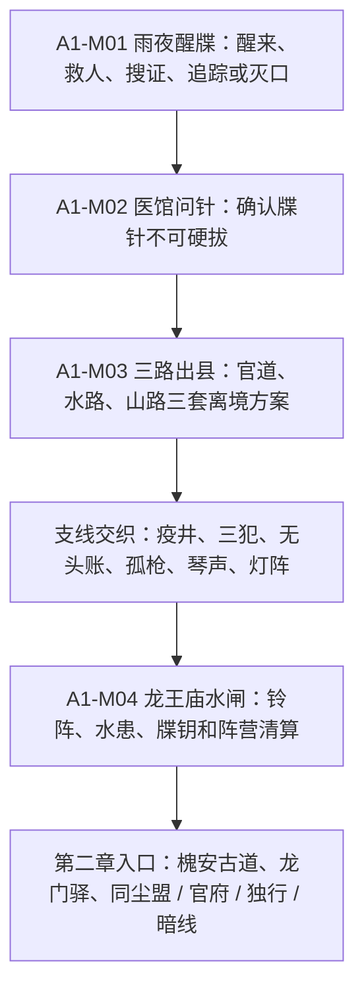

# 第一章《封境》章节圣经

状态：active draft
日期：2026-04-26
来源：基于 `script.md` 第一章内容扩写
用途：第一章剧情、任务、网站子页面和后续美术生成的文本样板。

## 1. 章节定义

### 1.1 一句话

玩家在清河渡雨夜醒来，腕上浮现照影牒针黑线；为了活下去并离开封锁的山水县，玩家必须在县衙、山神寨、疫村、医馆、牒使和水闸灾变之间选择谁被救、谁被牺牲、真相是否公开。

### 1.2 章节主题

**你以为自己只是要活着离开。**

第一章的真正主题是“局部秩序崩坏时，谁有资格决定牺牲”。县衙要维持封境，山神寨要夺回山路，医者要救牒针宿主，照影局要筛选可控武人，普通百姓只想活过水患和疫病。

### 1.3 玩家起点

- 从翻覆囚车旁醒来；
- 没有完整身份记忆；
- 腕脉有照影牒针黑线；
- 现场有死者、幸存押车兵、残缺牒录和黑衣牒使踪迹；
- 无名煞玩家会额外感到“杀掉证人能让路变简单”。

### 1.4 玩家终点

第一章结束时，玩家应至少带走一种通往第二章的资源：

- 第一枚牒钥；
- 县衙文书；
- 山神寨山路盟约；
- 唐小砚修复后的水路机关令；
- 桑芷整理出的牒针药引证据；
- 无名煞断因暗号；
- 或者一个代价更高的逃亡状态。

## 2. 区域地图

| 地点 | 功能 | 首次进入 | 关联任务 | 玩法重点 |
|---|---|---|---|---|
| 清河渡 | 开场翻车、第一场危机、牒针线索 | A1-M01 | 雨夜醒牒 | 救人、搜证、追踪、灭口、无名煞诱导。 |
| 山水县城 | 县衙、酒楼、医馆、牢城、黑市入口 | A1-M02 | 医馆问针、酒楼无头账 | 调查、话术、审案、偷听、城市潜入。 |
| 疫村 | 被封的村落、医棚、井下药符 | A1-M02 后 | 疫井、桑芷招募 | 药师、奇门、救治、隔离伦理。 |
| 山神寨 | 山路关卡、寨主偏厅、三犯案 | A1-M03 | 三路出县、山神寨三犯 | 结盟、审案、武力挑战、江湖声望。 |
| 龙王庙水闸 | 水路总机关、戏台、铃阵、终局战 | A1-M04 | 龙王庙水闸、琴声入夜 | 机关、音律、战斗、分洪、阵营抉择。 |
| 旧镖道 | 尸车、旧护送案、废亭与伏击点 | A1-M03 期间 | 旧镖道孤枪 | 护送、破军守线、旧案公开。 |
| 废书院 | 灯阵、藏书楼、牒录残页 | 任意探索 | 废书院灯阵 | 音律 / 奇门解谜、无名煞旧记忆。 |
| 清河黑市 | 伪造文书、蛊医、牒录交易 | 县城暗线 | 医馆问针、酒楼无头账 | 影踪、偷窃、交易、背刺。 |

## 3. 第一章阵营

### 3.1 县衙与封境官府

| 项 | 内容 |
|---|---|
| 公开诉求 | 封锁山水县，防止疫病、水患和武人冲突外溢。 |
| 隐藏诉求 | 县令何其庸曾配合照影局试验，正在销毁账册和证词。 |
| 代表人物 | 何其庸、裴照、牢城差役、封路兵。 |
| 可合作方式 | 交出证据、协助抓山神寨、压下疫村骚乱、帮县令稳住水闸。 |
| 可背叛方式 | 公开账册、放走囚犯、帮助山寨夺水路、在武籍审问中翻供。 |
| 奖励 | 官方通行文书、牢城钥匙、县库药材、后续照影城证词入口。 |
| 风险 | 桑芷、山神寨和同尘盟倾向下降；若真相被掩盖，第三章证词缺口扩大。 |

何其庸不是单纯贪官。他的逻辑是：山水县一旦失控，朝廷军镇会直接屠村封河。他选择跟照影局合作，是为了把“可死的人”控制在最少范围内。这个逻辑必须让玩家觉得可辩，但不可让他无罪。

### 3.2 山神寨

| 项 | 内容 |
|---|---|
| 公开诉求 | 解除封路，保护山民和被官府冤押的人。 |
| 隐藏诉求 | 寨中也有人借封境走私药材、私藏牒录残页。 |
| 代表人物 | 楚横山、寨中老药婆、三名被通缉者。 |
| 可合作方式 | 翻案三犯、治疗疫村、帮寨中夺回山路或水路。 |
| 可背叛方式 | 把三犯交官、烧寨粮、杀楚横山、引缉武司进山。 |
| 奖励 | 山路离境、山寨援兵、同尘盟前置声望。 |
| 风险 | 县衙敌对；若山寨被纵容成匪，第二章江湖阵营会更激进。 |

楚横山要有侠气，也要有山寨领袖的粗暴。他愿救人，但不相信县衙；他愿接纳玩家，但会要求玩家拿行动证明“不是照影局的狗”。

### 3.3 慈心医脉与疫村

| 项 | 内容 |
|---|---|
| 公开诉求 | 救治疫村和牒针宿主。 |
| 隐藏诉求 | 慈心医脉的药方曾被改造成牒针药引，桑芷不确定师门参与到什么程度。 |
| 代表人物 | 桑芷、疫村里正、老药婆、黑市蛊医。 |
| 可合作方式 | 救治病人、保留样本、公开药方、保护桑芷取证。 |
| 可背叛方式 | 烧井灭证、把宿主交给县衙、卖药方给黑市。 |
| 奖励 | 牒针压制药、桑芷入队、慈心残卷线索。 |
| 风险 | 若牒针宿主死亡过多，第三章医疗改造路线受损。 |

### 3.4 照影局外勤

| 项 | 内容 |
|---|---|
| 公开诉求 | 无。照影局在第一章不承认存在。 |
| 隐藏诉求 | 通过封境、水患和铃阵筛选可控宿主，清除不稳定武人。 |
| 代表人物 | 白微尘、黑衣牒使、断因暗号留下者。 |
| 可合作方式 | 追凶时接受交易、交出不稳定宿主、替白微尘灭证。 |
| 可背叛方式 | 夺牒钥、公开铃阵、救下宿主、留下证人。 |
| 奖励 | 第一枚牒钥、断因暗号、照影局短期放行。 |
| 风险 | 队友恐惧；后续照影局更早识别玩家。 |

白微尘在第一章承担“看似理性、实则残酷”的照影逻辑。他不是疯子。他认为山水县已经失控，水闸铃阵只是把未来灾祸提前结算。

### 3.5 清河帮与黑市

| 项 | 内容 |
|---|---|
| 公开诉求 | 走水路、保码头、卖消息。 |
| 隐藏诉求 | 有人替照影局运过机关件，也有人替山神寨走私药材。 |
| 代表人物 | 酒楼老板、黑市蛊医、清河船头。 |
| 可合作方式 | 买文书、走私出县、反利用传信。 |
| 可背叛方式 | 举报黑市、截断水路、偷牒录后嫁祸。 |
| 奖励 | 水路入口、伪造身份、任无踪早期传闻。 |
| 风险 | 被双面出卖，进入水闸时敌人部署升级。 |

## 4. 人物定义

### 4.1 第一章可入队 / 准入队角色

| 角色 | 第一章状态 | 战斗定位 | 剧情钩子 | 招募条件 |
|---|---|---|---|---|
| 桑芷 | 疫村医棚可正式入队 | 药师:济世，救急与牒针压制 | 师门药方被用于牒针药引。 | 救治疫村或保护牒针宿主；若烧井灭证，招募失败或高难。 |
| 唐小砚 | 水闸前临时协助，水闸后可入队 | 奇门:机括，机关与分洪 | 机关术被用于铃阵和水闸杀局。 | 在水闸给她拖延时间，或提前取得机括图。 |
| 柳听弦 | 酒楼 / 戏台接触，可第一章入队或埋线 | 音律:错律，识铃与控场 | 她追杀仇门，但铃阵让复仇失控。 | 在琴声入夜中阻止滥杀或帮她改目标。 |
| 韩霜铁 | 旧镖道孤枪可入队 | 破军:护法，守线与护送 | 曾护送牒针试验者，结局全死。 | 公开尸车真相或帮他完成守护，不把他交官。 |
| 谢停云 | 山水县酒楼可招募或暂留 | 游锋:截云，读招与破招 | 杀错人后封剑，害怕再做决定。 | 酒楼无头账中替他查明旧错，或迫使他拔剑救人。 |
| 裴照 | 县衙牢城准队友 / 强盟友 | 拳掌:擒龙，擒拿与缴械 | 相信律法，但律法被照影局借用。 | 让他看到县令账册或水闸真相；第一章通常不完全入队。 |

### 4.2 关键 NPC

| 人物 | 身份 | 第一章作用 | 可死亡 | 后续回收 |
|---|---|---|---|---|
| 白微尘 | 照影局牒使 | 终局对手、牒钥持有人、照影逻辑代言人 | 可死可逃 | 第二章照影楼坞线索；第三章照影局态度。 |
| 何其庸 | 山水县令 | 官府路线核心、掩盖试验者 | 可死可曝光 | 第三章武籍大审证人或缺席空位。 |
| 楚横山 | 山神寨主 | 江湖路线核心、山路出口 | 可死可盟友 | 第二章同尘盟倾向。 |
| 疫村里正 | 平民代表 | 隔离伦理、救人与封村冲突 | 可死 | 第三章山水县幸存者证词。 |
| 酒楼老板 | 双面中介 | 酒楼无头账、传信、黑市入口 | 可死 | 第二章鬼市价格与信任。 |
| 黑市蛊医 | 非正规医者 | 替代诊断、药方交易 | 可死 | 慈心医脉线污染或证据。 |
| 三名通缉者 | 山神寨三犯 | 审案支线核心 | 可死 | 官府 / 山寨阵营关系。 |

## 5. 第一章剧情推进

第一章不要求玩家完成所有支线，但要让每条支线改变水闸终局的一部分条件。玩家越愿意调查和救人，终局可用的低代价方案越多；玩家越倾向灭证和强闯，短期速度越快，后续证词与队友信任越少。

## 6. 主线任务

### A1-M01：雨夜醒牒

**触发：** 新游戏开场。
**目标：** 从清河渡翻覆囚车旁活下来，确认腕脉黑线不是普通伤口。
**主要场景：** 囚车残骸、河滩尸体、断桥下、黑衣牒使脚印、押车兵临终点。

| 解法 | 做法 | 直接后果 | 变量倾向 |
|---|---|---|---|
| 救人 | 救押车兵、民夫或囚车幸存者。 | 山水县城有人认出玩家救过人。 | `A1_DARK_ORIGIN_WITNESSES=spared` |
| 搜证 | 搜尸、取残缺牒录、检查符钉。 | 提前得到照影牒针字样，但被县衙怀疑盗尸。 | `A1_FIRST_TIE_KEY` 线索开启 |
| 追踪 | 追黑衣牒使脚印到断桥。 | 可提前听到照影铃，触发短暂牒针痛。 | 照影局注意玩家 |
| 自首 | 向县衙报案。 | 获得官府保护，但进入牢城审问。 | 官府路线开启 |
| 灭口 | 杀死幸存者或放任其死。 | 身份暂时隐藏，证词缺失。 | `A1_DARK_ORIGIN_WITNESSES=killed` |
| 无名煞 | 顺煞、压煞、引煞。 | 顺煞可快速清场；压煞获得抵抗计数；引煞可听到断因暗号。 | `DARK_ORIGIN_AWAKENING=stirred` |

**队友钩子：**

- 谢停云可在山水县酒楼听说“雨夜救人 / 雨夜杀人”的版本；
- 裴照会根据现场证词改变审问态度；
- 桑芷诊断时会询问黑线第一次发作时的情绪。

**失败推进：**

- 若玩家昏迷或战败，被县衙带入牢城，不结束游戏；
- 若所有证人死光，玩家进城更容易，但第三章缺少山水县水闸证词；
- 若追踪失败，黑衣牒使会在水闸部署更多警戒。

### A1-M02：医馆问针

**触发：** 玩家进山水县城，腕脉黑线发作。
**目标：** 找到懂牒针的人，确认它不可硬拔。
**主要场景：** 县城医馆、疫村医棚、黑市蛊医铺、废书院残卷、县衙验伤房。

| 解法 | 做法 | 直接后果 | 风险 |
|---|---|---|---|
| 找桑芷 | 去疫村医棚，让桑芷诊断。 | 获得压制药和慈心医脉线索。 | 若疫村被封死，进入困难。 |
| 找黑市蛊医 | 花钱或偷入清河黑市。 | 获得临时止痛药和牒针交易线索。 | 药有副作用，可能被卖给照影局。 |
| 找县衙验伤 | 接受官府检查。 | 获得合法病牒，可走官道。 | 被记录入册，裴照线提前开启。 |
| 查废书院 | 找牒录残页。 | 发现照影牒针历史比缉武司更古老。 | 灯阵误触，牒针发作。 |
| 找山寨老药婆 | 走山路求医。 | 获得山民偏方，可进入山神寨。 | 县衙视为通匪。 |

**核心揭示：**

牒针不可硬拔。硬拔会导致失忆、瘫痪、狂乱或死亡。它不是单纯毒物，而是药性、符禁、音律和机括共同锁住人的经脉反应。

**队友钩子：**

- 桑芷可正式入队；
- 唐小砚的机关件痕迹在诊断中被发现；
- 柳听弦可通过听脉发现“错拍”。

**失败推进：**

- 若玩家拒绝诊断，后续每次铃阵触发更危险；
- 若硬拔牒针，获得一次短期强力爆发，但永久失去部分记忆线索；
- 若交给县衙记录，官府路线变顺，黑市与山寨路线涨价。

### A1-M03：三路出县

**触发：** 山水县正式封境，城门、码头和山路全部封锁。
**目标：** 找到离开山水县的方式，并决定是否处理本地危机。
**结构：** 玩家可以只走一条，也可以三条都调查以获得更多终局资源。

| 路线 | 阻碍 | 解法 | 关联人物 | 终局资源 |
|---|---|---|---|---|
| 官道 | 缉武司封锁、县衙文书 | 辩论、贿赂、偷文书、帮县令灭证、裴照作保 | 何其庸、裴照 | 官方通行、牢城证据 |
| 水路 | 清河帮涨价、水闸失控 | 潜入码头、买船、修机关、反利用酒楼账 | 酒楼老板、唐小砚 | 水闸机关图、水路盟约 |
| 山路 | 山神寨拦路、疫村隔离 | 结盟、翻案三犯、治疗疫村、挑战寨主 | 楚横山、桑芷、韩霜铁 | 山路盟约、山寨援兵 |

**多路线奖励：**

- 官道 + 水路：可在水闸偷听县令和白微尘交易；
- 官道 + 山路：可让裴照和楚横山在终局对质；
- 水路 + 山路：可让唐小砚和山寨工匠合力改闸；
- 三路全通：水闸终局开启最低伤亡路线。

**无名煞钩子：**

三路中各有一名“未来祸端”被断因暗号标记。无名煞可以顺手杀掉其中一人，让对应路线变短，但后续真相缺失。

**失败推进：**

- 官道失败：玩家被通缉，但可从黑市进入水路；
- 水路失败：码头封锁升级，终局水患更严重；
- 山路失败：山神寨可能倒向同尘盟激进派。

### A1-M04：龙王庙水闸

**触发：** 玩家取得至少一种出县资源，或封境进入第三夜。
**目标：** 阻止照影铃阵，处理即将崩坏的水闸，并决定救谁、追谁、隐瞒谁。
**主要场景：** 庙前戏台、香火偏殿、水闸机关廊、阵眼闸室、泄洪水道。

| 区域 | 内容 | 特殊解法 |
|---|---|---|
| 庙前戏台 | 敌人伪装香客和戏班，铃声藏在鼓点里。 | 柳听弦识别错拍；音律角色提前削弱铃阵。 |
| 香火偏殿 | 县令密会白微尘，谈掩盖试验和封城责任。 | 影踪偷听；裴照对质；无名煞刺杀。 |
| 水闸机关廊 | 梁道、水廊、机关廊三层路径。 | 唐小砚改机关；奇门角色开捷径。 |
| 阵眼闸室 | 照影铃、水闸和牒针宿主同时失控。 | 桑芷救宿主；破军守线；游锋追白微尘。 |

**终局路线：**

| 路线 | 做法 | 结果 | 关键条件 |
|---|---|---|---|
| 侠义救城 | 稳住水闸，停铃，放走白微尘。 | 山水县存活，牒钥可能失去。 | 需要放弃追凶窗口。 |
| 追凶优先 | 追杀白微尘，夺取牒钥。 | 获得强线索，县城受灾。 | 游锋 / 影踪 / 射艺路线更顺。 |
| 官府合作 | 帮何其庸掩盖试验，换官方通行。 | 出县容易，桑芷可能离队。 | 县衙关系高。 |
| 山寨夺闸 | 帮楚横山控制水路。 | 江湖路线开启，县衙敌对。 | 山神寨同盟。 |
| 机关改闸 | 唐小砚完成分洪。 | 代价最低，水患可控。 | `A1_TANG_WATERGATE_FIX=true` |
| 医者救针 | 桑芷压制宿主，优先救人。 | 大量宿主存活，水闸损坏。 | `A1_SANG_TRUST=high` |
| 无名煞灭证 | 杀关键证人，制造天灾假象。 | 真相隐藏，断因房关注玩家。 | 无名煞顺煞或高杀戮路线。 |

**章节结尾状态：**

`A1_SHANSHUI_STATE` 写入 `saved / flooded / occupied / abandoned` 之一；`A1_FIRST_TIE_KEY` 写入 `obtained / lost / destroyed`；阵营和队友变量同时更新。

## 7. 支线任务

### A1-S01：疫井

**定位：** 药师 / 奇门支线，解释疫村不是普通瘟疫。
**触发：** 进入疫村后，村民争论是否填井。
**核心冲突：** 井下药符持续释放药性，能压制牒针宿主，也会让普通人发热、幻听、失眠。

| 解法 | 结果 |
|---|---|
| 药师净井 | 保留药性样本，救下多数病人，桑芷信任上升。 |
| 奇门拆符 | 找到照影局符禁来源，废书院灯阵降低难度。 |
| 暴力封井 | 疫情快速停止，但宿主死亡，医疗证据缺失。 |
| 黑市交易 | 把井符卖给蛊医，获得钱和药，后续黑市污染扩大。 |
| 无名煞 | 杀掉“将来会散播药符的人”，短期阻断传播，真相缺失。 |

**水闸回收：** 净井或拆符可让桑芷在终局救更多牒针宿主。

### A1-S02：山神寨三犯

**定位：** 审案支线，决定山神寨是否可信。
**触发：** 山神寨要求玩家评判三名通缉者：一个杀过差役，一个偷过县粮，一个私放过牒针宿主。
**核心冲突：** 三人都犯法，但罪名背后都有封境和照影试验的隐情。

| 解法 | 结果 |
|---|---|
| 交官 | 县衙关系上升，山寨敌对。 |
| 放人 | 山寨信任上升，裴照不满。 |
| 逐案翻案 | 需要证据，耗时最长，但可同时说服裴照和楚横山。 |
| 私刑 | 快速解决，山寨恐惧，后续同尘盟激进。 |
| 无名煞引煞 | 假装要杀三犯，引出真正照影线人。 |

**水闸回收：** 翻案成功可让裴照在水闸对质何其庸。

### A1-S03：酒楼无头账

**定位：** 调查支线，连接谢停云、黑市和照影局传信。
**触发：** 山水县酒楼出现“无头账”：账本有收支却没有买主姓名。
**核心冲突：** 酒楼老板替多方传信，账本里藏着水闸机关件、囚车路线和牒针宿主名单。

| 解法 | 结果 |
|---|---|
| 揭发老板 | 县衙查封酒楼，黑市入口关闭但证据保全。 |
| 收买老板 | 获得水路和黑市入口，证据可信度下降。 |
| 反利用传信 | 给白微尘假消息，终局敌人部署错位。 |
| 谢停云插手 | 旧决斗真相浮出，谢停云可能拔剑护人。 |
| 影踪偷账 | 不惊动任何阵营，后续可双面操作。 |

**水闸回收：** 掌握账本可进入香火偏殿偷听县令交易。

### A1-S04：旧镖道孤枪

**定位：** 韩霜铁队友线。
**触发：** 旧镖道上有一辆尸车，韩霜铁守在车前，不让县衙、山寨或黑市靠近。
**核心冲突：** 尸车里的人是牒针试验失败者；韩霜铁曾护送他们，以为是救治，结果亲手把他们送进死局。

| 解法 | 结果 |
|---|---|
| 帮他守车 | 韩霜铁信任上升，破军守线支援水闸。 |
| 公开真相 | 县衙与照影局关系暴露，山水县舆论爆炸。 |
| 焚车灭疫 | 疫病风险降低，但证据消失。 |
| 交给县衙 | 官府路线顺，韩霜铁离开或敌对。 |
| 无名煞顺煞 | 杀掉尸车中未死的宿主，短期安全，长期罪证断裂。 |

**水闸回收：** 韩霜铁可在阵眼闸室守住入口，让玩家追白微尘或救宿主。

### A1-S05：琴声入夜

**定位：** 柳听弦队友线、音律支线。
**触发：** 夜里酒楼或龙王庙戏台传出反复错拍的琴声。
**核心冲突：** 柳听弦追杀仇家，但她的复仇曲被照影铃阵借用，可能让无辜者发狂。

| 解法 | 结果 |
|---|---|
| 阻止滥杀 | 柳听弦不满但保留理智，护心曲线开启。 |
| 协助复仇 | 她入队更快，但错律更深。 |
| 改目标 | 找出真正利用仇案的人，柳听弦信任大增。 |
| 公审 | 裴照和柳听弦冲突，律法线与复仇线同时推进。 |
| 音律对调 | 把复仇曲改成护心调，终局可削弱铃阵。 |

**水闸回收：** 柳听弦能识别戏台鼓点中的照影铃错拍。

### A1-S06：废书院灯阵

**定位：** 音律 / 奇门解谜，补充照影旧史。
**触发：** 医馆问针、酒楼账本或山寨老药婆都可指向废书院。
**核心冲突：** 牒录残页藏在错位灯阵中。灯阵不是藏宝机关，而是早期照影局用来测试“人是否会按预测路线行动”的装置。

| 解法 | 结果 |
|---|---|
| 奇门破阵 | 获取完整牒录残页，唐小砚后续更容易改闸。 |
| 音律听拍 | 找到照影铃早期频率，柳听弦终局支援增强。 |
| 暴力拆阵 | 拿到残页碎片，但触发牒针痛。 |
| 按预测走完 | 开启无名煞旧记忆，发现自己曾来过这里。 |
| 放火烧楼 | 证据毁灭，照影局暂时无法追踪玩家。 |

**水闸回收：** 灯阵资料可降低阵眼闸室难度，并证明照影局源头早于缉武司。

## 8. 营地戏与队友冲突

第一章营地场景应至少覆盖以下类型：

| 场景 | 触发 | 作用 |
|---|---|---|
| 破庙止雨 | A1-M01 后第一次长休 | 队友或幸存者质疑玩家身份。 |
| 医棚争执 | 桑芷入队后 | 桑芷与黑市蛊医 / 唐小砚争论技术责任。 |
| 封剑夜谈 | 谢停云入队后 | 玩家可逼他拔剑、劝他封剑或让他承认旧错。 |
| 孤枪守火 | 韩霜铁入队后 | 他讲尸车旧案，破军护法路线开启。 |
| 错拍护心 | 柳听弦支线后 | 学会临时护心调，可用于无名煞压制。 |
| 无名煞夜行 | 无名煞觉醒后 | 玩家醒来站在队友床边，决定压制、解释或顺煞。 |

## 9. 剧本样段

### 9.1 A1-M01 雨夜醒牒

**旁白：**

雨声先回来。然后是铁锈味。最后是你自己的心跳。

它不太像你的心跳，更像有人隔着一面鼓，在替你数命。

你从翻覆的囚车里爬出来，腕上有一道细黑线，像一根被墨浸过的针，正沿着脉搏往里沉。

**押车兵：**

别过来。你腕上也有黑线。你也是他们的人？

**玩家选项：**

1. “我不知道这是什么。先止血。”
2. “他们是谁？”
3. “把刀放下，否则你会死得更快。”
4. 【药师】“别动，你中的是散脉粉，不是致命伤。”
5. 【影踪】观察脚印，判断袭击者去向。
6. 【奇门】检查囚车残留符钉。
7. 【无名煞】你忽然知道，只要割开他的喉咙，就没人知道你醒过。

**若选择压制无名煞：**

**旁白：**

那念头来得太熟。不是愤怒，不是恐惧，甚至不是恶意。

像手知道怎样握筷，舌知道怎样抵住牙。

杀人，对你来说，也许曾经只是一个习惯。

### 9.2 A1-M02 医馆问针

**桑芷：**

这不是毒。毒会走，针会留。

**玩家：**

针在哪里？

**桑芷：**

在你脉里，也在你记忆里。有人把药性、铃声和符禁缝到一起，让你的身体替他们记账。

她把银针悬在你的腕上，针尖没有落下，已经开始微微发颤。

**桑芷：**

硬拔可以。你会忘掉一些东西，也许是名字，也许是仇人，也许是怎么站起来。

**玩家选项：**

1. “先压住它。代价以后再说。”
2. “告诉我是谁做的。”
3. “如果我不想活在别人账上呢？”
4. 【药师】辨认药性来源。
5. 【奇门】询问符禁是否可拆。
6. 【无名煞】“如果杀掉知道方法的人，针会不会安静？”

### 9.3 A1-M04 龙王庙水闸

**白微尘：**

你以为我在杀人？

他站在阵眼闸室里，水声从脚下轰鸣，照影铃被吊在梁上，像一只没有舌头的铜鸟。

**白微尘：**

我是在让山水县少死一些人。今天不响铃，明日县城、山寨、疫村一起乱，死的会更多。

**桑芷：**

你连他们的名字都没问过。

**白微尘：**

名字不能阻止灾祸。记录可以。

**唐小砚：**

记录？你们把我的机关接到水闸上，让它决定哪条街先淹。你管这叫记录？

**玩家选项：**

1. “停铃，先救城。”
2. “牒钥给我，你可以走。”
3. “何其庸的账册在哪里？”
4. 【奇门】给唐小砚争取时间改闸。
5. 【音律】让柳听弦反制错拍。
6. 【破军】让韩霜铁守住机关廊。
7. 【无名煞】杀了白微尘，也杀了知道真相的人。

### 9.4 营地戏：无名煞夜行

夜营。雨停了。所有人都睡得很浅。

你醒来时，发现自己站在桑芷身边，手里握着一根银针，针尖对准她颈侧。

**旁白：**

你不记得自己何时起身。

你只知道这一针下去，她不会叫出声。

她知道太多牒针的事。她活着，会让路变复杂。

桑芷睁开眼。

**桑芷：**

你要杀我？

**玩家选项：**

1. “我不知道我为什么在这里。”
2. “快走，离我远点。”
3. “我不会让它控制我。”
4. “你知道得太多了。”
5. 【药师】把针反刺自己穴位，压住杀意。
6. 【音律】哼起柳听弦教你的护心调。
7. 【无名煞：顺煞】杀了她。

**后果：**

- 压制成功：桑芷信任上升，但开始研究你的杀意来源；
- 失败但未杀：桑芷恐惧，后续治疗线变难；
- 杀死桑芷：慈心医脉主线关闭，无名煞路线加深。

## 10. 第一章最小验收清单

- A1-M01 到 A1-M04 均有触发、目标、场景、解法、队友钩子、失败推进和变量倾向；
- A1-S01 到 A1-S06 均能影响水闸终局或后续章节；
- 桑芷、唐小砚、柳听弦、韩霜铁、谢停云、裴照在第一章有明确状态；
- 何其庸、楚横山、白微尘都不是单纯工具人；
- 无名煞每次出现都能选择顺煞、压煞、引煞或承担后果；
- 第一章结束时，玩家能以官府、江湖、独行、技术、医疗或黑暗路线进入第二章。
